# Shakti-Setu: A Full-Stack AI-Enabled Legal Empowerment Platform for Women in India

## A Thesis-Style Technical Report

### Author
Harshal Patil

### Project
Shakti-Setu (Client-Server Full-Stack Application)

### Date
March 2026

---

## Abstract

This report presents the complete design, implementation, architecture, and technical analysis of Shakti-Setu, a full-stack legal empowerment platform focused on women in India. The system integrates secure user and lawyer identity management, legal information access, AI-assisted support, consultation workflows, moderated community interaction, and analytics-driven governance features into one unified digital ecosystem.

The platform is implemented using a modern React + Vite client and an Express + MongoDB backend. It employs role-segregated authentication models for users and lawyers, administrative moderation controls, consultation and chat workflows, legal-article engagement systems, public and authenticated feedback channels, and periodic analytics report generation. The solution further incorporates multilingual interface support (English, Hindi, Tamil, Marathi, Telugu) on the frontend and AI integration for both legal-assistant responses and demographic insight generation.

This document formalizes the system using software engineering artifacts expected in research/thesis submissions: problem framing, requirement engineering, architectural decomposition, data model analysis, API layer design, workflow/state modeling, trust and safety analysis, operational model, scalability strategies, risk matrix, and future research directions.

The report demonstrates that Shakti-Setu is not merely a CRUD web application; rather, it is a socio-technical intervention platform that combines legal accessibility, guided consultation pathways, feedback intelligence, and operational governance to reduce legal information asymmetry for women.

---

## Keywords

Women legal empowerment, legal-tech, full-stack architecture, AI assistant, Express, React, MongoDB, consultation workflow, feedback analytics, multilingual UX, trust and safety.

---

## Table of Contents

1. Introduction
2. Problem Context and Motivation
3. Objectives and Scope
4. Research Questions and Hypotheses
5. Methodology and Engineering Approach
6. System Overview
7. Requirements Engineering
8. High-Level System Architecture
9. Frontend Architecture
10. Backend Architecture
11. Data Model and Persistence Design
12. API Design and Endpoint Taxonomy
13. Core Workflow Designs
14. AI Integration Design
15. Security, Privacy, and Trust Design
16. Performance, Scalability, and Reliability
17. Feedback Intelligence and Reporting Subsystem
18. Community Moderation and Safety Model
19. Internationalization and Accessibility
20. Deployment and Operational Model
21. Quality Strategy and Testing Framework
22. Limitations
23. Future Work and Research Extensions
24. Conclusion
25. References and Standards Mapping
26. Appendices

---

## 1. Introduction

Shakti-Setu is a mission-oriented digital platform designed to increase legal awareness and legal-service accessibility for women. The platform combines legal knowledge dissemination, consultation facilitation, and AI-powered guidance into one coherent interface. It is intentionally designed for heterogeneous user groups: general users (women seeking legal information and support), lawyers (service providers), and administrators (governance and safety).

Unlike traditional legal portals that focus only on static documentation, Shakti-Setu delivers an interaction-centered model:

- Discovery layer: legal resources, helplines, rights articles.
- Guidance layer: AI legal assistant and demographic insights.
- Service layer: lawyer discovery, consultation request lifecycle, and chat.
- Governance layer: reporting, admin moderation, status controls, and analytics.
- Trust layer: role-based authentication, moderation controls, and abuse handling.

The architectural result is a hybrid legal-tech platform where information, service, and trust systems are tightly integrated.

---

## 2. Problem Context and Motivation

### 2.1 Domain Problem

Women in many contexts face a multi-dimensional legal access gap:

- Legal language complexity and procedural uncertainty.
- Information fragmentation across government and legal-aid sites.
- Limited awareness of rights and recourse channels.
- Difficulty finding verified legal professionals.
- Social hesitation in discussing sensitive legal issues.

### 2.2 Technical Opportunity

A modern web platform can mitigate these barriers by:

- Simplifying legal information delivery.
- Personalizing rights and issue guidance by user profile context.
- Enabling structured consultation workflows.
- Supporting anonymity-controlled community interaction.
- Providing multilingual interfaces to reduce comprehension barriers.

### 2.3 Why a Full-Stack + AI Model

The domain requires both deterministic workflows (identity, consultation, moderation, reporting) and probabilistic support (AI-driven explanations and insights). Therefore, the system adopts:

- Deterministic backend for authoritative state transitions and compliance-sensitive operations.
- AI augmentation for explainability, summarization, and language adaptation.

---

## 3. Objectives and Scope

### 3.1 Primary Objectives

- Build a secure legal assistance platform for women.
- Enable trusted lawyer onboarding with admin verification.
- Provide consultation and communication workflows.
- Deliver AI-guided legal support and tailored rights insights.
- Establish governance mechanisms through reporting and analytics.

### 3.2 Secondary Objectives

- Support multilingual interface interactions.
- Maintain role clarity among users, lawyers, and admins.
- Preserve extensibility for mobile, notifications, and predictive modules.

### 3.3 Scope Boundaries

In-scope:

- User and lawyer registration/login.
- Admin moderation and status governance.
- Consultation lifecycle and post-consultation rating.
- Chat for accepted consultations only.
- Legal article reading and reaction tracking.
- Feedback analytics with periodic report generation.
- Community posts/comments/reactions with moderation safeguards.

Out-of-scope (current release):

- Real-time socket communication.
- Formal legal advice certification workflow.
- Payment gateway integration.
- End-to-end legal case document workflow.

---

## 4. Research Questions and Hypotheses

### RQ1
Can a role-based full-stack legal platform reduce friction between legal awareness and legal action?

### RQ2
Does AI-assisted legal guidance improve user decision readiness before lawyer consultation?

### RQ3
Can integrated feedback analytics improve governance quality and service accountability?

### Working Hypotheses

- H1: Structured consultation workflows increase legal service uptake versus static information portals.
- H2: AI-generated contextual guidance improves perceived clarity of legal options.
- H3: Periodic analytics and moderation reduce unsafe content and low-quality service recurrence.

---

## 5. Methodology and Engineering Approach

The project follows an iterative architecture-first approach:

1. Domain decomposition (identity, legal content, consultation, governance).
2. Layered API modeling and schema design.
3. Client state and UX flow implementation.
4. AI augmentation integration.
5. Risk controls and moderation logic.
6. Operational analytics and scheduled reporting.

Engineering principles used:

- Separation of concerns.
- Role isolation and token type enforcement.
- Safe defaults and explicit status-driven workflows.
- Progressive enhancement (public read + authenticated write).
- Analytics-backed administration.

---

## 6. System Overview

Shakti-Setu consists of:

- Frontend web client (React + Vite + Redux Toolkit).
- Backend REST API server (Express + Mongoose).
- MongoDB persistence layer.
- AI service integrations (Gemini) for assistant and insight generation.
- Scheduled analytics subsystem for feedback reporting.

### 6.1 System Context Diagram

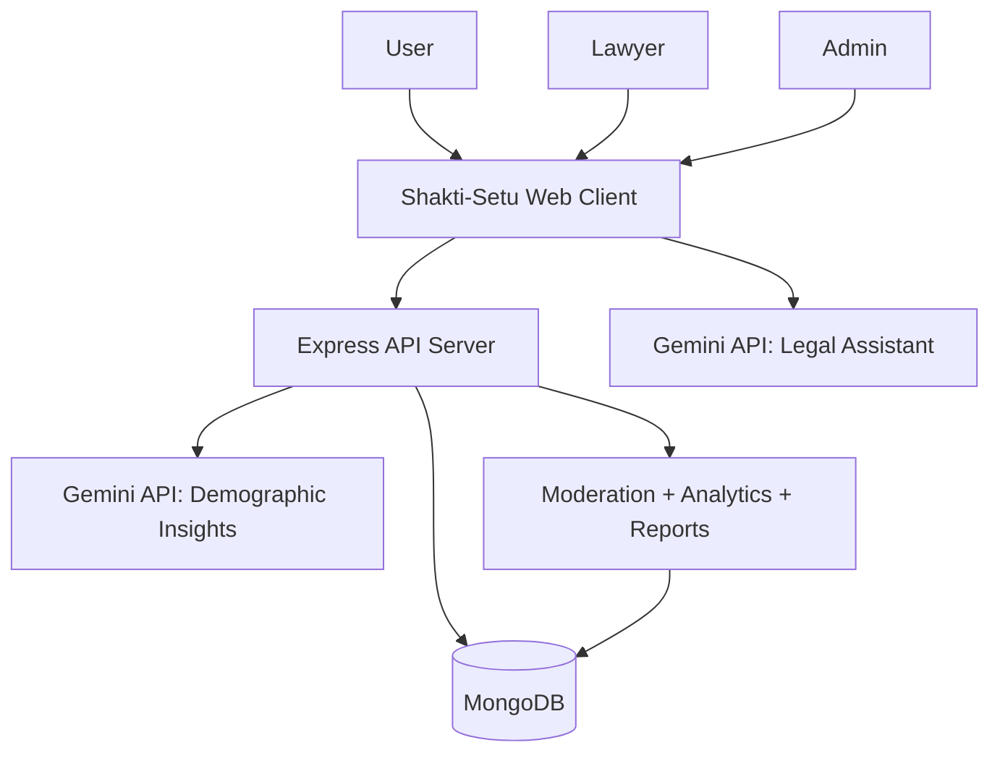

### 6.2 Container Architecture Diagram

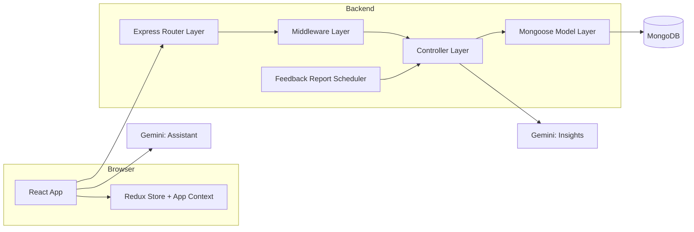

---

## 7. Requirements Engineering

### 7.1 Functional Requirements

- FR1: User registration, login, and profile management.
- FR2: Lawyer registration with pending approval and status transitions.
- FR3: Admin management of user suspension and lawyer suspension/approval.
- FR4: Consultation request creation and status lifecycle transitions.
- FR5: Chat access only during accepted consultation state.
- FR6: Rights article browsing, preview, read count, and reactions.
- FR7: Public and private feedback operations.
- FR8: Community post/comment/reaction interactions with safety constraints.
- FR9: Reporting mechanism against users/lawyers.
- FR10: Analytics report generation and listing.
- FR11: AI legal assistant and profile-aware dashboard insights.
- FR12: Multilingual interface support.

### 7.2 Non-Functional Requirements

- NFR1: Authentication isolation for user and lawyer token types.
- NFR2: Predictable status transitions for consultation and moderation flows.
- NFR3: Data integrity via schema constraints and index strategy.
- NFR4: Safe failure behavior for external AI dependencies.
- NFR5: UI responsiveness for desktop/mobile and role-based navigation.
- NFR6: Extendability for future channels and automation.

---

## 8. High-Level System Architecture

### 8.1 Architectural Style

The architecture follows a layered monolith style with clear separations:

- Presentation layer: React components and client state slices.
- Service interaction layer: axios APIs + interceptors.
- Transport layer: Express routes.
- Application layer: controllers and orchestration logic.
- Domain/persistence layer: Mongoose models and indexed collections.
- Background intelligence layer: scheduler + analytics utilities.

### 8.2 Layered Server View

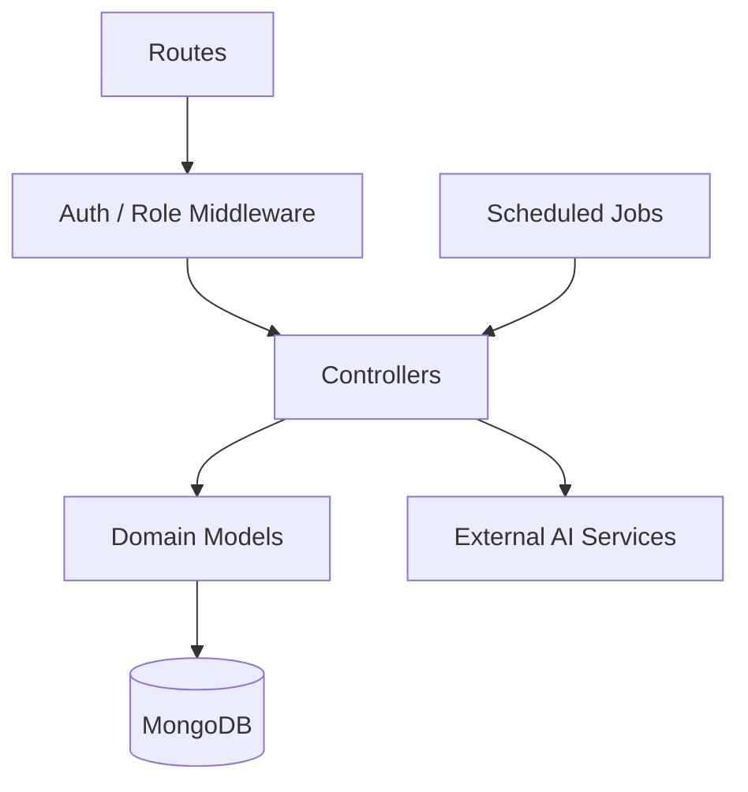

### 8.3 Design Rationale

- Routes stay thin and declarative.
- Controllers own business rules and guard clauses.
- Middleware centrally enforces identity boundaries.
- Models encapsulate constraints and indexes.
- Utilities centralize analytics formulas and report generation logic.

---

## 9. Frontend Architecture

### 9.1 Technology Stack

- React 19 (component architecture)
- Vite 7 (build/runtime tooling)
- Redux Toolkit (normalized async state)
- Axios (API orchestration)
- AppContext (cross-cutting UI state + i18n)

### 9.2 Client Composition

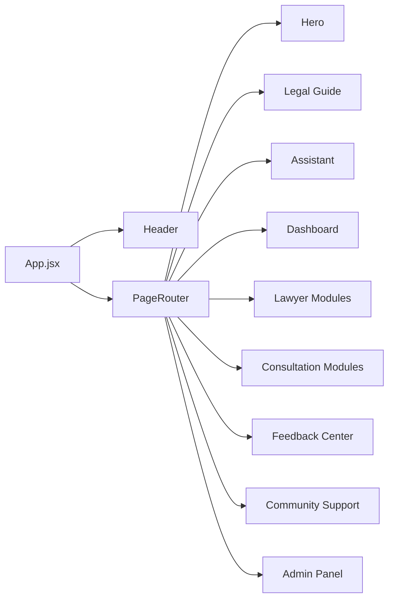

### 9.3 State Strategy

- Redux slices:
  - auth
  - lawyer
  - consultation
- AppContext:
  - page routing state
  - language and translations
  - article open state
  - dashboard cached payload
  - chat and register transient context

This hybrid strategy balances global identity state with UI flow state and i18n concerns.

### 9.4 Internationalization Layer

Current frontend i18n provides language metadata and translation dictionaries for:

- English (`en`)
- Hindi (`hi`)
- Tamil (`ta`)
- Marathi (`mr`)
- Telugu (`te`)

Fallback strategy: selected language dictionary merges over English defaults.

---

## 10. Backend Architecture

### 10.1 Core Framework

- Express 5 application server
- JSON middleware + CORS
- Route mounts under `/api/*`

### 10.2 Mounted Route Domains

- `/api/auth`
- `/api/dashboard`
- `/api/lawyers`
- `/api/consultations`
- `/api/admin`
- `/api/reports`
- `/api/resources`
- `/api/articles`
- `/api/feedback`
- `/api/community`

### 10.3 Middleware Boundaries

- `authMiddleware`: validates user token and rejects lawyer token misuse.
- `lawyerAuthMiddleware`: validates lawyer token and rejects user token misuse.
- `chatAuthMiddleware`: supports either role and creates canonical `chatActor` identity.
- `adminMiddleware`: allows only user role `admin`.
- `optionalAuthMiddleware`: enriches request with user identity if token present; never blocks.

---

## 11. Data Model and Persistence Design

### 11.1 Core Collections

- User
- Lawyer
- Consultation
- Message
- Article
- ArticleReaction
- Feedback
- FeedbackAnalyticsReport
- Report
- CommunityPost
- CommunityComment
- CommunityPostReaction
- CommunityCommentReaction

### 11.2 Entity-Relationship Diagram

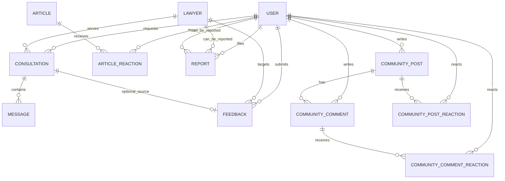

### 11.3 Notable Schema Semantics

- Consultation statuses enforce lifecycle contract: `pending`, `accepted`, `rejected`, `completed`, `cancelled`.
- Feedback model supports platform and lawyer targets and stores sentiment plus quality dimensions.
- Community entities include summary counters and status fields for soft moderation.
- Article reactions enforce uniqueness per (user, article).
- Report model supports two report types (`user`, `lawyer`) and admin resolution metadata.

### 11.4 Indexing Strategy Highlights

- Consultation indexes on `(lawyer, status)` and `(user, status)`.
- Message index on `(consultation, createdAt)` for ordered retrieval.
- Feedback indexes for user history, lawyer analytics, and rating trend analysis.
- Community indexes for active listing by recency/activity and tag filtering.

---

## 12. API Design and Endpoint Taxonomy

### 12.1 API Style

The API follows REST-style route grouping with role-sensitive access control.

### 12.2 Domain Endpoint Matrix (Condensed)

| Domain | Public Read | Authenticated User | Authenticated Lawyer | Admin |
|---|---|---|---|---|
| Auth | register/login | me/profile/saved-lawyers | - | - |
| Lawyers | approved listing | - | me/profile/stats | pending/status updates |
| Consultation | lawyer profile | create/list/rate/cancel | list/update status | - |
| Chat | - | read/send (accepted consultations only) | read/send (accepted consultations only) | - |
| Articles | list/get/read | like/dislike | - | create/update/delete |
| Feedback | lawyer summary | CRUD own feedback | own performance | analytics + reports |
| Community | list/get/list-comments | post/comment/react/delete own | - | moderation via ownership override |
| Reports | - | report user/lawyer | - | resolve/list via admin routes |

### 12.3 API Interaction Diagram

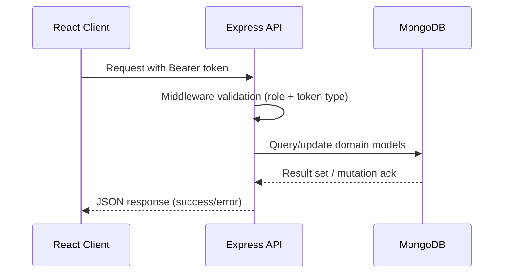

---

## 13. Core Workflow Designs

### 13.1 User Onboarding + Insights

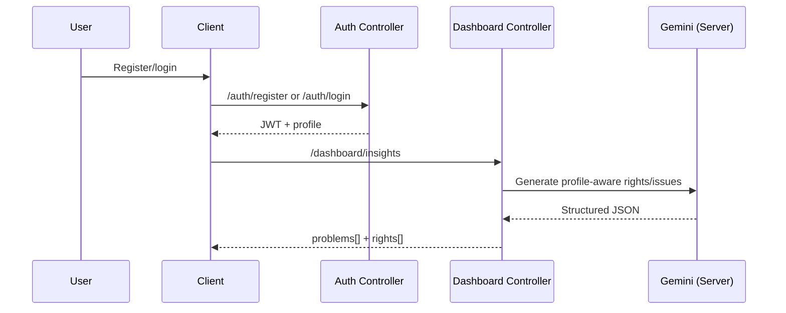

### 13.2 Consultation Lifecycle State Model

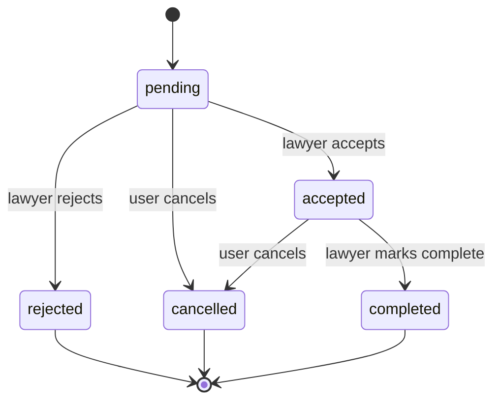

### 13.3 Consultation + Chat Flow

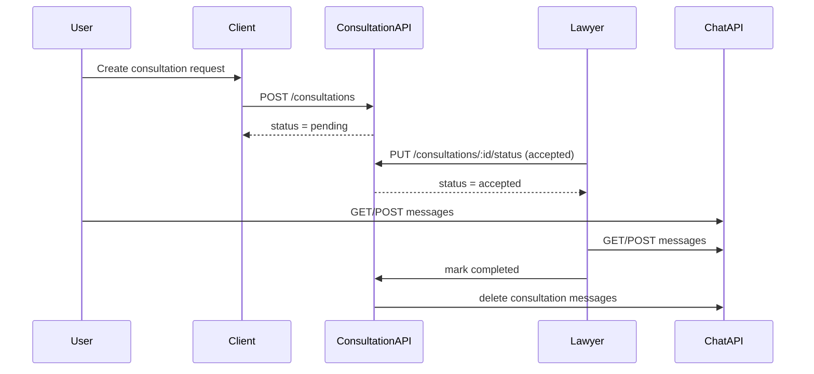

### 13.4 Community Interaction Flow

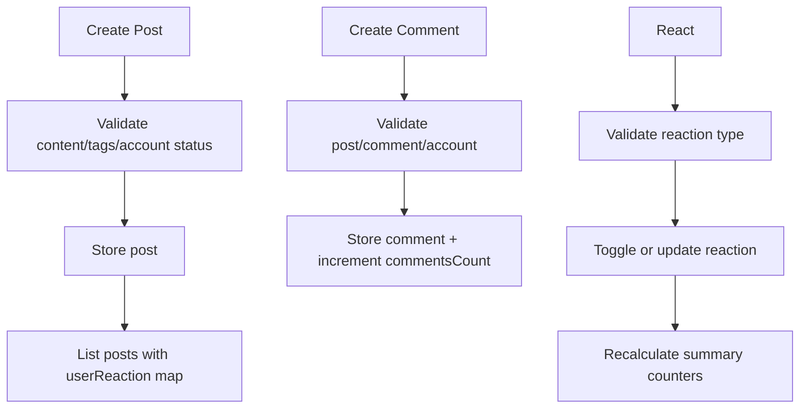

---

## 14. AI Integration Design

### 14.1 AI Modules

- Module A: Server-side demographic insights generation for dashboard.
- Module B: Client-side legal assistant response generation with grounding intent.

### 14.2 AI Design Principles

- AI augments but does not replace legal professionals.
- Responses are constrained through system prompts.
- Outputs are mapped into structured fields where possible.
- Fallback behavior is used if AI service is unavailable.

### 14.3 Known Architectural Gap

The dashboard insight schema is currently bilingual at source (`en`, `hi`), while frontend i18n supports five languages. This introduces an important future harmonization task: either multilingual generation server-side or deterministic translation pipeline for dashboard items.

---

## 15. Security, Privacy, and Trust Design

### 15.1 Authentication and Authorization

- JWT with explicit token type (`user` or `lawyer`) to prevent cross-role token confusion.
- Route-level middleware ensures least-privilege access.
- Admin routes protected through stacked auth + role middleware.

### 15.2 Domain Guard Clauses

- Suspended users/lawyers are blocked from restricted operations.
- Lawyers must be approved for listing/consultation eligibility.
- Consultation self-request prevention (user email vs lawyer email check).
- One pending request rule per user-lawyer pair.

### 15.3 Community Safety Controls

- Account suspension check before post/comment/reaction writes.
- Status-based soft deletion (`active`, `deleted`, `hidden`).
- Ownership check for delete operations with admin override.
- Anonymous identity masking for viewers except allowed contexts.

### 15.4 Trust and Abuse Reporting

- Structured reporting model supports user/lawyer complaints.
- Admin resolution includes action status and notes.
- Governance data is auditable via persisted report metadata.

### 15.5 Privacy Notes

- User-identifying information is role-scoped.
- Password hashes are not returned in query projections.
- Anonymous posting/commenting supported in community workflows.

---

## 16. Performance, Scalability, and Reliability

### 16.1 Current Performance Enablers

- Indexed query paths for high-frequency filters.
- Pagination in feedback/community listing endpoints.
- Aggregate-driven analytics computation for reporting.
- Job scheduler for asynchronous analytics report creation.

### 16.2 Scalability Evolution Path

Phase 1 (current): modular monolith.

Phase 2:

- Move chat to websocket gateway.
- Introduce cache for hot article/community feeds.
- Decouple analytics into worker service.

Phase 3:

- Event-driven pipeline (consultation/feedback/report events).
- Search service for legal content and lawyers.
- Multi-region deployment with read replicas.

### 16.3 Reliability Controls

- Defensive try/catch around controller edges.
- Explicit status responses for invalid domain transitions.
- Idempotent report scheduler behavior through unique period constraints.

---

## 17. Feedback Intelligence and Reporting Subsystem

The platform has a mature analytics subsystem beyond basic ratings.

### 17.1 Data Sources

- Direct user feedback entries.
- Consultation-derived rating backfill (legacy and missing synchronization).

### 17.2 Derived Metrics

- Average rating
- Positive/neutral/negative ratios
- NPS score
- Satisfaction index
- Dimension averages (ease of use, response time, legal clarity, support quality, value for money)

### 17.3 Mathematical Definitions

Let rating distribution be $d_1, d_2, d_3, d_4, d_5$ and total $N = \sum_{k=1}^{5} d_k$.

$$
\text{Average Rating} = \frac{1\cdot d_1 + 2\cdot d_2 + 3\cdot d_3 + 4\cdot d_4 + 5\cdot d_5}{N}
$$

$$
\text{NPS} = \left(\frac{d_5 - (d_1 + d_2 + d_3)}{N}\right)\cdot 100
$$

Satisfaction index is composite (rating + sentiment weighting):

$$
\text{Satisfaction Index} = 0.7\cdot\left(\frac{\text{AvgRating}}{5}\cdot 100\right) + 0.3\cdot(\text{PositiveRatio})
$$

### 17.4 Reporting Pipeline Diagram

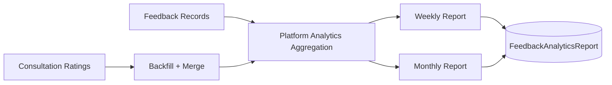

### 17.5 Scheduler Lifecycle

- Initial delayed execution after server startup.
- Daily recurring cycle.
- Generates weekly and monthly reports.
- Avoids duplicates via unique period constraints unless forced.

---

## 18. Community Moderation and Safety Model

### 18.1 Moderation Strategy

- Soft deletion over hard deletion for traceability.
- Anonymity by default for posts; optional for comments.
- Role-aware identity reveal logic.
- Reaction toggles with recalculated summary state.

### 18.2 Safety State Semantics

- `active`: visible and interactive.
- `deleted`: content masked (`[deleted]`), references retained.
- `hidden`: moderation-intended invisibility pattern.

### 18.3 Community Trust Diagram

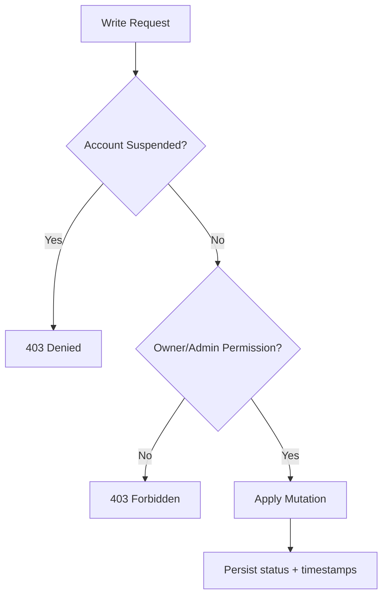

---

## 19. Internationalization and Accessibility

### 19.1 i18n Strategy

- Central translation registry with supported language metadata.
- Language persisted client-side and propagated via context.
- English fallback merge to prevent blank UI labels.
- Speech recognition and TTS locale mappings aligned to selected language.

### 19.2 Accessibility Considerations

- Icon + text combinations for navigation clarity.
- Role-based simplified interaction pathways.
- Voice interaction support for input/output in key flows.

### 19.3 Future i18n Research Direction

- Move from key-based dictionaries to namespace-based i18n modules.
- Add server-assisted locale content negotiation for article/resources metadata.
- Implement script-aware typography and QA checks for non-Latin language rendering.

---

## 20. Deployment and Operational Model

### 20.1 Current Deployment Topology (Logical)

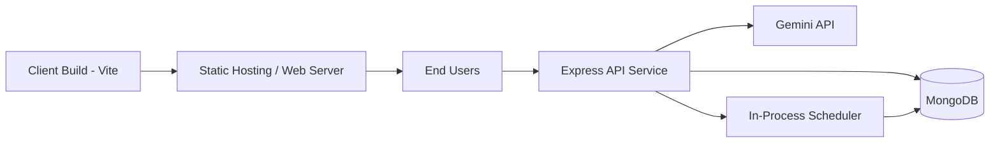

### 20.2 Environment Configuration

- Client environment:
  - API base URL
  - Optional assistant key
- Server environment:
  - Mongo URI
  - JWT secret + expiry
  - Gemini key
  - Port

### 20.3 Operational Recommendations

- Use secret manager for key handling.
- Enforce HTTPS and secure headers.
- Add rate limiting and request size controls.
- Add centralized logging and request tracing.

---

## 21. Quality Strategy and Testing Framework

### 21.1 Suggested Test Pyramid

- Unit tests:
  - middleware token parsing and role checks
  - analytics utility formulas and date windows
- Integration tests:
  - consultation status transitions
  - chat access constraints
  - article reaction toggling and count updates
- E2E tests:
  - user onboarding -> dashboard insights
  - lawyer onboarding -> admin approval -> consultation flow
  - feedback submission -> report visibility

### 21.2 Verification Matrix (Representative)

| Module | Critical Case | Expected Result |
|---|---|---|
| Auth | lawyer token on user route | rejected (`Invalid token type`) |
| Consultation | duplicate pending request | blocked with explanatory message |
| Chat | non-accepted consultation | chat denied |
| Articles | repeated like/dislike | single reaction preserved, counts synced |
| Feedback | duplicate per consultation | conflict response |
| Community | non-owner delete | forbidden unless admin |

### 21.3 Static and Build Quality

- Linting pipeline available in client scripts.
- Build artifacts validated through Vite production build.
- Further work: CI gate for lint + test + build + basic security checks.

---

## 22. Limitations

1. AI outputs can vary and require legal-disclaimer framing.
2. Real-time communication is polling-based rather than websocket-based.
3. Some analytics computations execute on-demand and may require further optimization at scale.
4. Frontend i18n depth is stronger than multilingual depth in all server-generated payloads.
5. Formal legal-document workflows are not yet integrated.

---

## 23. Future Work and Research Extensions

### 23.1 Engineering Extensions

- WebSocket chat with typing/presence indicators.
- Queue-based background workers for analytics and notifications.
- Search index for legal docs and lawyer skills.
- Role-specific notification center (email/SMS/push).

### 23.2 AI/ML Extensions

- Retrieval-augmented generation using legal corpus snapshots.
- Explainability scoring and citation confidence levels.
- Multilingual summarization pipelines for legal content.
- Early risk triage model for urgent legal situations.

### 23.3 Governance Extensions

- Automated anomaly detection on moderation events.
- Lawyer reliability index combining responsiveness + sentiment + complaint density.
- Explainable moderation dashboards with audit timelines.

### 23.4 Research Directions

- Comparative study of AI-assisted vs non-AI legal guidance outcomes.
- Impact analysis of multilingual UX on legal information retention.
- Trust calibration models for human-AI legal support systems.

---

## 24. Conclusion

Shakti-Setu demonstrates a practical, socially relevant, and technically robust legal-tech architecture that integrates legal information, service workflows, AI assistance, and governance analytics into one platform. Its design balances user accessibility with operational controls: role-separated authentication, status-driven lifecycle logic, moderation paths, and analytics-backed admin tooling.

From a software architecture perspective, the project is a strong modular monolith foundation with clear future migration paths to event-driven and microservice-enhanced deployments. From a societal perspective, it operationalizes legal empowerment by reducing informational barriers and connecting users to real service pathways.

The project is therefore suitable both as a production-grade prototype and as a thesis-caliber case study in applied full-stack architecture for public-interest technology.

---

## 25. References and Standards Mapping

### 25.1 Conceptual References

- REST Architectural Style
- RBAC (Role-Based Access Control)
- JWT Authentication Best Practices
- OWASP Top 10 (Web Application Security)
- C4-inspired architecture decomposition

### 25.2 Platform Technologies

- React, Redux Toolkit, Vite
- Node.js, Express, Mongoose, MongoDB
- Google Gemini API

### 25.3 Suggested Academic Anchors (for final submission formatting)

- Human-centered legal technology literature
- AI-assisted decision support systems
- Trust and safety engineering in social platforms
- Multilingual accessibility in civic-tech platforms

---

## 26. Appendices

## Appendix A: Route Inventory (Condensed)

- Auth: register, login, me, profile, saved-lawyers
- Lawyers: register/login, approved listing, me/profile/stats, admin approval controls
- Consultations: create/list/rate/cancel, lawyer status updates, chat endpoints
- Articles: list/get/read, reactions, admin CRUD
- Feedback: user CRUD, lawyer summary/performance, admin analytics/reporting
- Community: posts/comments read-write-reaction-delete
- Reports: report user/lawyer
- Dashboard: AI demographic insights
- Admin: stats/users/lawyers/reports moderation
- Resources: static legal helplines and links

## Appendix B: Example Non-Functional SLO Targets (Proposed)

- Auth response p95 < 300 ms (excluding network)
- Consultation list p95 < 500 ms
- Community feed page load p95 < 700 ms
- Report generation (manual) < 10 s for moderate dataset
- Error budget target: 99.5% monthly endpoint success rate

## Appendix C: Risk Register

| Risk | Type | Severity | Mitigation |
|---|---|---|---|
| AI hallucination in legal responses | Product/Safety | High | strict prompting + disclaimer + lawyer referral |
| Token misuse between roles | Security | High | token type validation middleware |
| Toxic or abusive community content | Trust/Safety | Medium-High | reporting + admin moderation + status controls |
| Analytics inconsistency across legacy records | Data Integrity | Medium | backfill + merged aggregation logic |
| Scale bottlenecks in heavy aggregations | Performance | Medium | periodic materialization + indexing + worker offload |

## Appendix D: Visual Roadmap (Conceptual)

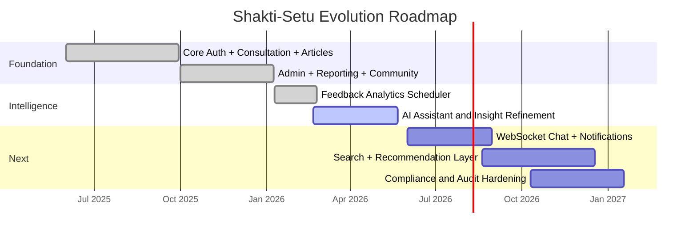

## Appendix E: Thesis Submission Formatting Notes

For institutional submission, this report can be converted directly to PDF and adapted to university template requirements:

- Front matter: certificate, declaration, acknowledgments.
- Body chapters: retain sections 1-24.
- Back matter: references in APA/IEEE style.
- List of figures/tables auto-generated from markdown/PDF toolchain.

---

### End of Report
